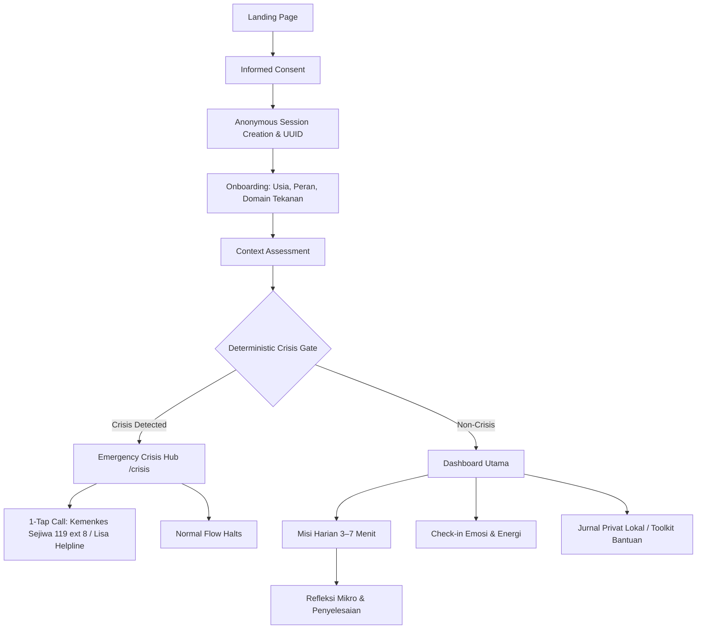

# Dengar.in

> **Dengar.in — Pendamping Mental Well-being Anonim Berbasis AI**

Dengar.in adalah platform pendamping kesehatan mental digital yang bersifat **100% anonim**, bebas registrasi (tanpa nama, email, atau nomor telepon), dan berbasis konteks nyata kehidupan untuk masyarakat Indonesia berusia **15–54 tahun**. 

Platform ini menjembatani kesenjangan antara beban emosional, akar masalah situasional (studi, karir, finansial/pinjol, keluarga), tindakan pemulihan mikro harian (3–7 menit), dan evaluasi berkelanjutan—didukung oleh sistem penanganan krisis deterministik yang aktif tanpa perantara kecerdasan buatan (AI).

---

## 1. Project Overview

### Latar Belakang & Masalah yang Diselesaikan
Kesehatan mental tidak terjadi di ruang hampa. Sebagian besar tekanan emosional berakar pada tekanan nyata kehidupan: tuntutan akademik, lingkungan kerja toksik, himpitan ekonomi dan teror pinjaman online ilegal, atau ekspektasi keluarga. Namun, solusi digital yang ada saat ini umumnya terbagi menjadi dua ekstrem:
1. **Artikel statis** yang pasif dan tidak memberikan panduan aksi konkret.
2. **Chatbot AI tanpa batas** yang berisiko memberikan halusinasi klinis atau bertindak sebagai terapis semu tanpa protokol keselamatan yang teruji.

Dengar.in hadir untuk menghubungkan 5 mata rantai yang kerap terputus:
```
[ 1. Beban Emosional ]
          ↓
[ 2. Konteks Nyata Hidup (Sekolah / Kampus / Kerja / Finansial / Relasi / Keluarga) ]
          ↓
[ 3. Tindakan Kecil Nyata (Misi harian 3–7 menit: grounding / reframing / batasan) ]
          ↓
[ 4. Eskalasi Bantuan Profesional (Hotline darurat resmi terverifikasi) ]
          ↓
[ 5. Pendampingan Berkelanjutan (Check-in harian / jurnal lokal / laporan mingguan) ]
```

### Konteks Hidup yang Didukung
- **Sekolah & Ujian (Usia 15–17)**: Tekanan ujian masuk, nilai akademik, perlindungan khusus anak di bawah umur.
- **Dunia Kampus (Usia 18–24)**: Tugas akhir/skripsi, adaptasi merantau, kecemasan prospek karir.
- **Beban Pekerjaan (Usia 25–34 & 35–54)**: *Burnout*, konflik kantor, jam kerja berlebih, kelelahan mental kronis.
- **Tekanan Finansial**: Tekanan hutang, intimidasi penagihan pinjaman online ilegal, beban generasi *sandwich*.
- **Hubungan & Cinta**: Patah hati, isolasi sosial, kesepian di perantauan.
- **Dinamika Keluarga**: Ekspektasi orang tua, konflik internal, tanggung jawab nafkah.
- **Kesepian & Hampa**: Ketiadaan tempat bercerita yang aman dan bebas dari penghakiman.
- **Beban Pikiran Umum**: Kelelahan emosional umum yang belum terpetakan pemicunya.

> [!NOTE]
> **Batasan Produk**: Dengar.in adalah alat pendamping mandiri (*self-help companion*), **BUKAN pengganti psikolog, psikiater, layanan medis darurat, atau penasihat hukum/keuangan berlisensi**. Platform ini tidak memberikan diagnosis klinis ataupun resep obat.

---

## 2. Core Principles

- **Anonymous by Design**: Tanpa formulir registrasi, tanpa verifikasi email, tanpa nomor telepon. Identitas pengguna didasarkan pada UUID lokal acak dan frasa pemulihan 12 kata.
- **Privacy-First**: Seluruh catatan jurnal dan riwayat check-in disimpan secara lokal di peramban pengguna (*client-side local persistence*).
- **Non-Diagnostic**: Tidak pernah mengeluarkan label diagnosis psikiatri (DSM-5 / PPDGJ / ICD-10).
- **Context-Aware Support**: Personalisasi alur intervensi berdasarkan usia, peran aktivitas, dan sumber tekanan hidup utama.
- **Human-Centered**: Mengutamakan kenyamanan, ketenangan kognitif, dan kepastian rasa aman bagi pengguna yang sedang tertekan.
- **Crisis-First Safety Architecture**: Filter deteksi krisis berjalan 100% deterministik sebelum proses apa pun berjalan.
- **AI Bounded by Application Controls**: Kecerdasan buatan dibatasi secara ketat oleh skema aksi yang tervalidasi dan tidak memiliki akses ke gerbang krisis hidup.
- **Zero Unnecessary PII**: Tidak ada pengumpulan data identitas pribadi (*Personally Identifiable Information*).

---

## 3. Current MVP User Flow

Alur interaksi pengguna saat ini dirancang secara terstruktur dan tenang:



### Cabang Penanganan Krisis (Crisis Branch)
Jika pada asesmen awal atau input teks bebas terdeteksi indikasi bahaya diri atau krisis akut:
1. Alur normal dan otomatisasi AI langsung dihentikan secara instan.
2. Pengguna dialihkan ke layar `/crisis` yang memuat saluran darurat resmi nasional (Kemenkes Sejiwa 119 ext 8, Lisa Helpline, KPAI untuk remaja).

### Cabang Non-Krisis (Standard Flow)
1. Menghitung skor keletihan emosional non-diagnostik (Ringan, Menengah, Tinggi).
2. Membuka Dashboard dengan jalur terpersonalisasi 14 hari.
3. Menyajikan Misi Harian sesuai domain tekanan dan fitur pencatatan Check-in emosi.

---

## 4. Features

### Implemented (Fitur yang Berfungsi Penuh)
- **Anonymous UUID Session**: Pembuatan sesi unik berbasis UUID v4 tanpa akun dan tanpa backend database.
- **12-Word Recovery Mnemonic**: Pembangkitan kunci pemulihan 12-kata berbasis peramban untuk memulihkan sesi di perangkat lain.
- **Informed Consent**: Penjelasan transparan batasan hukum, medis, dan privasi dengan verifikasi persetujuan interaktif.
- **Guided 3-Step Onboarding**: Pemilihan kelompok usia (15–17, 18–24, 25–34, 35–54), status peran, dan domain tekanan utama secara bertahap (satu pertanyaan per layar).
- **Generic Context Assessment**: Kuesioner evaluasi beban emosional bertahap dengan visual terfokus dan skor evaluasi non-diagnostik.
- **Deterministic Crisis Engine**: Pemindaian teks deterministik sub-milidetik terhadap kata kunci bahaya, metode melukai diri, serta normalisasi anti-evasi (*leetspeak*, pemanjangan karakter).
- **Emergency Crisis Hub (`/crisis`)**: Tampilan darurat berprioritas tinggi dengan tombol panggil langsung 1-tap (*tel:*) dan tautan WhatsApp resmi.
- **Domain-Specific Daily Missions (`/mission`)**: Modul intervensi bertahap dengan linimasa vertikal, estimasi durasi, panduan aksi, dan kolom refleksi mikro.
- **Daily Mood Check-in (`/checkin`)**: Pemilih suasana hati taktil 5-tingkat, penggeser tingkat energi 1–10, chip pemicu tekanan, catatan singkat, dan riwayat check-in.
- **Local Browser Persistence**: Penyimpanan data sesi, misi, refleksi, jurnal, dan check-in sepenuhnya di `localStorage` peramban.
- **Permanent Data Wipe**: Utilitas pembersihan total data lokal di menu `/recovery` untuk menjaga kerahasiaan saat berbagi perangkat.
- **Verified Directory (`/resources`)**: Direktori kontak darurat, konseling psikologis, perlindungan anak, dan advokasi pinjaman online ilegal dengan filter kategori dan pencarian.
- **Local Private Journal (`/journal`)**: Ruang menuangkan pikiran secara bebas yang tersimpan privat di peramban tanpa terkirim ke server mana pun.
- **Companion Chat Simulator (`/chat`)**: Antarmuka percakapan terpandu yang dilengkapi filter keselamatan deterministik serta validasi skema aksi ketat.
- **Responsive Layout & Accessibility**: Desain responsif mobile/tablet/desktop dengan dukungan keyboard navigation, fokus visual terstandarisasi, dan `@media (prefers-reduced-motion)`.

### UI / Design System ("Soft Calm Glass")
- **Minimalism**: Tipografi tertata, visual tanpa kebisingan (*low noise*), hierarki jelas, spasi bernapas yang lega.
- **Soft Material**: Permukaan dengan radius sudut lembut (`rounded-2xl`, `rounded-3xl`), elevasi bayangan halus (*soft shadows*), dan kontras teks tinggi yang ramah aksesibilitas.
- **Restrained Glassmorphism**: Efek kaca translusen dengan blur lembut (`backdrop-blur-md`, `border-white/70`) yang digunakan **secara selektif** hanya pada navigasi, kartu hero fitur, dan elemen mengambang kontekstual. Permukaan solid tetap digunakan pada konten teks padat, pertanyaan asesmen, dan antarmuka krisis.
- **Reusable Primitives**: `PageContainer`, `ContentColumn`, `SplitLayout`, `GlassCard`, `SoftCard`, `Button`, `Input`, `Textarea`, `Chip`, `Badge`, `ProgressBar`, `HelpButton`, `MoodSelector`, `MissionCard`.

### Current Skeleton / Planned (Belum Diimplementasikan Penuh)
- **Ruang Cerita Anonim (`/forum`)**: *Route Skeleton* — Pratinjau antarmuka cerita solidaritas pengguna. Kerangka backend (`/api/forum`, `services/persistence`) sudah tersedia dengan moderasi wajib (`pending_review` default), namun masih memakai penyimpanan in-memory; adapter PostgreSQL/Supabase serta moderasi otomatis direncanakan untuk sprint lanjutan.
- **Laporan Mingguan (`/report`)**: *Route Skeleton* — Pratinjau visual ringkasan kemajuan 7 hari. Kerangka backend stateless (`/api/report/weekly`) sudah tersedia untuk mensintesis ringkasan dari riwayat lokal klien; penyimpanan agregat sisi server direncanakan untuk sprint lanjutan.
- **AI Provider Live Cloud Orchestrator**: Kerangka pipeline bertingkat (`services/orchestrator`: Tier 1 DeepSeek V4 Flash → Tier 2 OpenRouter → Tier 3 fallback deterministik) dan endpoint `/api/chat` sudah tersedia, divalidasi via `services/validator`; kunci API produksi dan pengujian model live belum dikonfigurasi.

---

## 5. Safety Architecture

Keselamatan pengguna adalah prioritas tertinggi di atas estetika dan fitur kecerdasan buatan.

```
Input Pengguna (Asesmen / Chat / Catatan)
               │
               ▼
┌────────────────────────────────────────┐
│  DETERMINISTIC CRISIS ENGINE           │
│  (services/crisis-engine)              │
│  - Katalog Pola Bahasa Distress ID     │
│  - Deteksi Niat Melukai Diri Sendiri   │
│  - Normalisasi Teks & Anti-Evasion     │
│  - ZERO AI / LLM Dependencies          │
└────────────────────────────────────────┘
               │
      ┌────────┴────────┐
      ▼                 ▼
[CRISIS DETECTED]  [NON-CRISIS]
      │                 │
      ▼                 ▼
Proses AI STOP!    Lanjut ke Alur Normal /
Alihkan ke Layar   Validasi Skema Aksi AI
Darurat Resmi      (services/validator)
```

### Isolasi Mutlak Crisis Engine
Paket `services/crisis-engine` memiliki batasan arsitektur ketat:
- **NOL Ketergantungan AI**: Dilarang mengimpor atau menggunakan LLM, OpenAI, DeepSeek, Google GenAI, OpenRouter, embeddings, vector database, atau network API eksternal apa pun.
- **Deterministik Penuh**: Beroperasi murni menggunakan normalisasi string (*anti-leetspeak*, *letter-elongation collapse*) dan pencocokan pola regex terhadap katalog frasa krisis bahasa Indonesia.
- **Prioritas Eksekusi**: Menjadi filter utama (Langkah 0) sebelum data pengguna diproses oleh modul lain.
- **AI Tidak Dapat Membatalkan**: AI tidak memiliki izin ataupun metode untuk mengabaikan atau menimpa keputusan gerbang krisis.

---

## 6. Anonymity & Privacy

- **Identitas Kriptografis Lokal**: Sesi diidentifikasi menggunakan UUID v4 (`crypto.randomUUID`) yang dibuat langsung di peramban klien.
- **12-Kata Kunci Pemulihan**: Menggunakan katalog kata-kata tenang bahasa Indonesia terpilih untuk pencadangan manual tanpa akun.
- **Tanpa PII**: Tidak ada field database, form, atau log yang meminta nama asli, nomor identitas (NIK), email, atau nomor seluler.
- **Penyimpanan Lokal Saja (Local-First)**: Data sesi, refleksi misi, dan catatan check-in disimpan di `localStorage` peramban pengguna. Tidak ada sinkronisasi cloud tanpa persetujuan eksplisit.
- **Pembersihan Data Sekali Klik**: Tersedia opsi *Hapus Permanen* di halaman `/recovery` untuk menghapus seluruh jejak lokal seketika.

---

## 7. Technology Stack

### Current Implementation

| Lapisan | Teknologi | Versi | Catatan |
|---|---|---|---|
| **Framework** | [Next.js](https://nextjs.org/) (App Router) | `15.1.4` | React Server/Client Components, Static Generation |
| **UI Library** | [React](https://react.dev/) | `19.0.0` | Antarmuka deklaratif interaktif |
| **Bahasa** | [TypeScript](https://www.typescriptlang.org/) | `5.7.3` | Strict typechecking di seluruh monorepo |
| **Styling** | [Tailwind CSS](https://tailwindcss.com/) | `3.4.17` | Desain token kustom & utilitas glassmorphism |
| **Ikonografi** | [Lucide React](https://lucide.dev/) | `^1.16.0` | Ikon visual konsisten dan ringan |
| **Monorepo** | npm Workspaces | `10.x+` | Manajemen paket monorepo lintas aplikasi & modul |
| **Test Runner** | Node.js Test Runner | Native | `node --experimental-strip-types` (Zero external test runner) |
| **Linter** | ESLint | `8.57.1` | Standalone `@typescript-eslint` dengan 0 error/warning |

### Backend Skeleton (Sprint 2 Foundation)

| Lapisan | Paket | Catatan |
|---|---|---|
| **HTTP API** | `apps/web/src/app/api/*` | Route Handlers Next.js (`/api/chat`, `/api/forum`, `/api/forum/[postId]/moderate`, `/api/report/weekly`, `/api/sync`, `/api/health`) |
| **AI Orchestrator** | `services/orchestrator` (`@dengarin/orchestrator`) | Pipeline bertingkat Tier 1 (DeepSeek) → Tier 2 (OpenRouter) → Tier 3 (fallback deterministik), lihat `docs/AI_POLICY.md` |
| **Prompt Templates** | `packages/prompts` (`@dengarin/prompts`) | Sistem prompt & batasan larangan AI, dikonsumsi hanya oleh `services/orchestrator` |
| **Persistence** | `services/persistence` (`@dengarin/persistence`) | Kontrak repositori forum & sinkronisasi terenkripsi; adapter in-memory untuk pengembangan lokal |

### Planned / Future Technologies
- **LLM Engine**: DeepSeek V4 Flash (Primary) / OpenRouter API (Fallback) — kunci API produksi & pengujian live belum dikonfigurasi.
- **Database (Sprint 2+)**: PostgreSQL / Supabase — akan diimplementasikan sebagai adapter baru dari `ForumRepository`/`SyncRepository` di `services/persistence`, menggantikan adapter in-memory saat ini.

---

## 8. Project Structure

Repositori menggunakan arsitektur monorepo berbasis npm Workspaces:

```
Denger.in/
├── apps/
│   └── web/                     # Aplikasi Next.js 15 (Frontend + Backend API)
│       ├── src/
│       │   ├── app/             # Rute App Router (/consent, /dashboard, dll.)
│       │   │   └── api/         # Route Handlers backend (/api/chat, /api/forum, /api/report/weekly, /api/sync, /api/health)
│       │   ├── components/      # Komponen navigasi, footer, dan UI primitives
│       │   │   └── ui/          # Primitives: GlassCard, SoftCard, Button, Layout, dll.
│       │   └── lib/
│       │       ├── api/         # Crisis gate wrapper, rate limiter, repositori singleton, helper respons JSON
│       │       └── storage.ts   # Manajemen sesi anonim & storage peramban
│       ├── tailwind.config.js   # Konfigurasi token desain visual Soft Calm Glass
│       └── tsconfig.json
├── packages/
│   ├── types/                   # Definisi tipe data TypeScript global (@dengarin/types)
│   ├── config/                  # Katalog kontak darurat, misi, dan opsi domain (@dengarin/config)
│   └── prompts/                 # Template & batasan prompt AI, khusus konsumsi services/orchestrator (@dengarin/prompts)
├── services/
│   ├── crisis-engine/           # Detektor krisis deterministik tanpa AI (@dengarin/crisis-engine)
│   ├── validator/               # Validator runtime skema aksi AI (@dengarin/validator)
│   ├── orchestrator/            # Pipeline AI bertingkat: DeepSeek → OpenRouter → fallback deterministik (@dengarin/orchestrator)
│   └── persistence/             # Kontrak repositori forum & sinkronisasi terenkripsi, adapter in-memory (@dengarin/persistence)
├── tests/
│   ├── crisis/                  # 33 pengujian unit mesin krisis (normalisasi, false-positive, slang)
│   ├── validator/               # 24 pengujian unit validator skema aksi kecerdasan buatan
│   ├── orchestrator/            # Pengujian pipeline tiered fallback AI orchestrator
│   └── persistence/             # Pengujian repositori forum & sinkronisasi in-memory
├── docs/                        # Dokumentasi arsitektur, PRD, kebijakan keselamatan, dan UX
├── .env.example                 # Contoh variabel lingkungan backend (kunci AI, DATABASE_URL)
├── package.json                 # Konfigurasi monorepo root & script eksekusi
└── tsconfig.base.json           # Konfigurasi TypeScript dasar monorepo
```

---

## 9. Routes

| Route | Tujuan / Fungsi | Status Implementasi |
|---|---|---|
| `/` | Halaman beranda utama dengan editorial hero, filosofi, dan direktori domain | **Implemented** |
| `/consent` | Persetujuan batasan hukum, privasi, dan non-medis | **Implemented** |
| `/onboarding` | Panduan pemilihan kelompok usia, peran, dan domain beban hidup | **Implemented** |
| `/assessment` | Kuesioner evaluasi beban emosional bertahap dengan filter keselamatan | **Implemented** |
| `/crisis` | Saluran tanggap darurat resmi dengan tombol telepon 1-tap | **Implemented** |
| `/dashboard` | Dasbor utama: misi harian aktif, status check-in, dan alat bantuan | **Implemented** |
| `/mission` | Panduan langkah misi intervensi harian dengan kolom refleksi | **Implemented** |
| `/checkin` | Pencatatan suasana hati harian, energi, pemicu stres, dan riwayat | **Implemented** |
| `/recovery` | Tampilan 12-kata kunci pemulihan sesi dan utilitas pembersihan data | **Implemented** |
| `/journal` | Jurnal privat lokal bebas jejak di peramban pengguna | **Implemented (Local-First)** |
| `/chat` | Antarmuka pendamping interaktif berbasis aksi tervalidasi | **Implemented (Local Simulator)** |
| `/resources` | Direktori layanan bantuan profesional & hotline terverifikasi | **Implemented** |
| `/forum` | Ruang cerita solidaritas anonim sesama pengguna | **Skeleton (Sprint 0)**, backend API tersedia |
| `/report` | Laporan evaluasi sintesis kemajuan mingguan | **Skeleton (Sprint 0)**, backend API tersedia |

---

## 9a. Backend HTTP API (Kerangka Sprint 2+)

Permukaan HTTP backend diimplementasikan sebagai Next.js Route Handlers di `apps/web/src/app/api/`, memakai logika dari `services/crisis-engine`, `services/orchestrator`, `services/validator`, dan `services/persistence`. Lihat `docs/API_SPEC.md` Bagian 5 untuk kontrak permintaan/respons lengkap.

| Endpoint | Metode | Tujuan / Fungsi | Status |
|---|---|---|---|
| `/api/health` | `GET` | Health check layanan backend | **Implemented** |
| `/api/chat` | `POST` | Gerbang krisis deterministik → orkestrator AI bertingkat → aksi tervalidasi | **Skeleton** (fallback deterministik aktif; kunci API live belum dikonfigurasi) |
| `/api/forum` | `GET`, `POST` | Daftar cerita yang disetujui; kirim cerita baru (otomatis `pending_review`, discan gerbang krisis) | **Skeleton** (penyimpanan in-memory) |
| `/api/forum/[postId]/moderate` | `PATCH` | Setujui/tolak cerita forum | **Skeleton** (belum ada autentikasi moderator) |
| `/api/report/weekly` | `POST` | Sintesis ringkasan mingguan stateless dari riwayat check-in/misi lokal klien | **Implemented** |
| `/api/sync` | `GET`, `PUT` | Simpan/ambil blob terenkripsi klien berdasarkan hash frasa pemulihan 12-kata | **Skeleton** (enkripsi ujung-ke-ujung belum diimplementasikan) |

> [!NOTE]
> Endpoint di atas adalah kerangka arsitektur (scaffolding), bukan layanan produksi. Lihat variabel lingkungan pada `.env.example` (`DEEPSEEK_API_KEY`, `OPENROUTER_API_KEY`, `DATABASE_URL`) sebelum menghubungkan penyedia AI atau basis data sungguhan.

---

## 10. Crisis Resources

Daftar saluran bantuan darurat di dalam repositori dikurasi secara ketat dan memiliki status verifikasi resmi:

| Lembaga | Kategori | Kontak | Waktu Operasional | Biaya | Status |
|---|---|---|---|---|---|
| **Kemenkes Sejiwa** | Darurat Nasional | `119 ext 8` | 24 Jam / 7 Hari | Bebas Pulsa | `verified_official` |
| **Lisa Helpline** | Pencegahan Krisis | `021-3777-5472` / WA `0811-381-5472` | 24 Jam (ID / EN) | Tarif Standar | `verified_official` |
| **Yayasan Pulih** | Konseling Trauma | `021-788-42580` / WA `0811-8436-633` | Hari Kerja | Tarif Standar | `verified_official` |
| **KPAI & Teencare** | Perlindungan Remaja | `1500-771` / WA `0811-177-2273` | 24 Jam / 7 Hari | Bebas Pulsa | `verified_official` |
| **Satgas PASTI / OJK** | Teror Pinjol / Finansial | `157` / WA `081-157-157-157` | Hari Kerja | Tarif Standar | `verified_official` |

> [!IMPORTANT]
> Seluruh nomor bantuan darurat wajib diverifikasi ulang secara manual oleh operator sebelum pelaksanaan peluncuran produksi publik.

---

## 11. Development

### Prasyarat
- **Node.js**: Versi `20.x`, `22.x`, atau `24.x` (mendukung flag native TypeScript `--experimental-strip-types`)
- **npm**: Versi `10.x` atau lebih baru

### Instalasi Dependensi
```bash
npm install
```

### Menjalankan Server Pengembangan Lokal
```bash
npm run dev
```
Akses aplikasi melalui peramban di `http://localhost:3000`.

### Menjalankan Seluruh Validasi Otomatis
```bash
# 1. Menjalankan rangkaian unit test (crisis engine & validator)
npm run test

# 2. Validasi tipe TypeScript di seluruh monorepo
npm run typecheck

# 3. Pemeriksaan linting ESLint
npm run lint

# 4. Kompilasi production bundle Next.js
npm run build
```

---

## 12. Validation

Status validasi otomatis saat ini di repositori:

| Uji Kelayakan | Cakupan | Hasil |
|---|---|---|
| **Crisis Engine Tests** | 33 pengujian (anti-evasi, leetspeak, frasa bunuh diri, false-positive) | **33 / 33 PASS** |
| **Action Validator Tests** | 24 pengujian (whitelist 6 aksi, sanitasi disclaimer, penolakan tindakan medis) | **24 / 24 PASS** |
| **Typecheck** | `tsc --noEmit` pada seluruh paket dan aplikasi | **0 Errors** |
| **Lint** | ESLint pada seluruh komponen dan modul TypeScript | **0 Errors, 0 Warnings** |
| **Production Build** | `next build` App Router (17 rute statis terkompilasi) | **SUCCESS** |

*Catatan: Verifikasi otomatis melalui subagent browser Playwright dapat bergantung pada ketersediaan driver biner lokal di lingkungan sistem operasi.*

---

## 13. Design System

Visual Dengar.in menerapkan konsep identitas **"Soft Calm Glass"**:
- **Warna Alami**: Palet warna yang dirancang untuk meredakan ketegangan mata, berpusat pada nuansa *sage calm* (`#38614F`), *warm sand* (`#FAF8F5`, `#F4F0E8`), dan *soft terracotta* (`#D97736`).
- **Pemanfaatan Kaca Selektif**: Efek kaca translusen hanya diaplikasikan pada navigasi atas, kartu hero, dan elemen mengambang kontekstual untuk memberikan kedalaman berdimensi tanpa mengorbankan keterbacaan.
- **Aksesibilitas Kontras Tinggi**: Pada konten panjang, form interaktif, pertanyaan asesmen, dan antarmuka darurat, sistem menggunakan kartu material solid berkontras tinggi untuk memastikan kepatuhan standar WCAG.
- **Dukungan Gerak Berkurang**: Animasi dan transisi dinonaktifkan secara otomatis bagi pengguna yang mengaktifkan preferensi *prefers-reduced-motion*.

---

## 14. Security & Safety Notes

### Perlindungan Saat Ini (Current Implementation)
- **Isolasi Logika Krisis**: Logika keselamatan hidup beroperasi secara independen di sisi klien/server tanpa campur tangan model generatif.
- **Validasi Skema Aksi Ketat**: Segala respons kecerdasan buatan disaring melalui whitelist 6 aksi terdefinisi; aksi ilegal (seperti diagnosis atau rekomendasi pinjaman) langsung dibatalkan.
- **Sesi Bebas Identitas**: Identitas berbasis UUID acak lokal yang tidak memerlukan database identitas kependudukan.
- **Data Tersimpan Lokal**: Catatan emosional dan jurnal disimpan di peramban lokal tanpa log server sentral.

### Fitur Keamanan Direncanakan (Planned)
- Sinkronisasi awan berbasis enkripsi *zero-knowledge end-to-end*.
- Sistem moderasi otomatis untuk konten forum komunitas publik sebelum tayang.

---

## 15. Roadmap

### Completed (Sprint 0 & Sprint 1)
- [x] Fondasi arsitektur monorepo, paket konfigurasi, dan tipe data global.
- [x] Mesin deteksi krisis deterministik bahasa Indonesia (33 pengujian tervalidasi).
- [x] Runtime action whitelist validator untuk output AI (24 pengujian tervalidasi).
- [x] Alur pengguna inti: Landing → Consent → Anonymous UUID → Onboarding → Assessment → Dashboard → Mission → Check-in.
- [x] Direktori bantuan darurat resmi Indonesia terverifikasi.
- [x] Redesain sistem visual "Soft Calm Glass" dan restrukturisasi hierarki tata letak 12-kolom responsif.
- [x] Integrasi penyimpanan lokal aman (*client-side local persistence*).
- [x] Kerangka backend: HTTP API (`apps/web/src/app/api`), pipeline AI orkestrator bertingkat (`services/orchestrator`), template prompt (`packages/prompts`), dan kontrak persistensi in-memory (`services/persistence`).

### Planned (Sprint 2+)
- [ ] Konfigurasi kunci API produksi & pengujian live model inferensi AI (DeepSeek V4 Flash / OpenRouter) — pipeline dan skema aksi terikat sudah tersedia di `services/orchestrator`.
- [ ] Adapter PostgreSQL/Supabase untuk `services/persistence` (menggantikan adapter in-memory) dan moderasi keselamatan otomatis untuk Ruang Cerita Anonim (`/forum`).
- [ ] Autentikasi moderator untuk `/api/forum/[postId]/moderate` dan penyimpanan agregat sisi server untuk Laporan Kemajuan Mingguan (`/report`).
- [ ] Enkripsi ujung-ke-ujung sungguhan untuk opsi sinkronisasi antarperangkat menggunakan frasa 12-kata — kontrak penyimpanan (`/api/sync`) sudah tersedia sebagai kerangka.

---

## 16. Team

Proyek Dengar.in dikembangkan dan dikelola oleh:
- **Dengar.in Team** (MindCraft Web Competition 2026)

---

## 17. Competition Context

Dengar.in dikembangkan dalam rangka keikutsertaan pada:
- **Kompetisi**: MindCraft Web Competition 2026
- **Tema**: *"Building Digital Solutions for Mental Well-being"*

Proyek ini dirancang untuk mendemonstrasikan bagaimana teknologi web modern dapat menghadirkan ruang aman kesehatan mental yang berempati, menjunjung tinggi privasi anonim, serta memiliki tata kelola keselamatan klinis yang kokoh.

---

## 18. Disclaimer

> **Pernyataan Penyangkalan (Disclaimer):**  
> Dengar.in adalah purwarupa pendamping mandiri digital (*self-help well-being prototype*) dan **BUKAN pengganti layanan medis, psikoterapi profesional, diagnosis psikiatri, atau penanganan gawat darurat klinis**. Platform ini tidak menyediakan diagnosis, resep obat, ataupun nasihat hukum dan keuangan.  
> Jika Anda atau seseorang yang Anda kenal berada dalam kondisi krisis akut, memiliki pikiran untuk menyakiti diri sendiri, atau membutuhkan bantuan darurat segera, hubungi saluran darurat resmi **Kemenkes Sejiwa di 119 ext 8** atau kunjungi instalasi gawat darurat fasilitas kesehatan terdekat.

---

## 19. License

License: Not yet specified.
